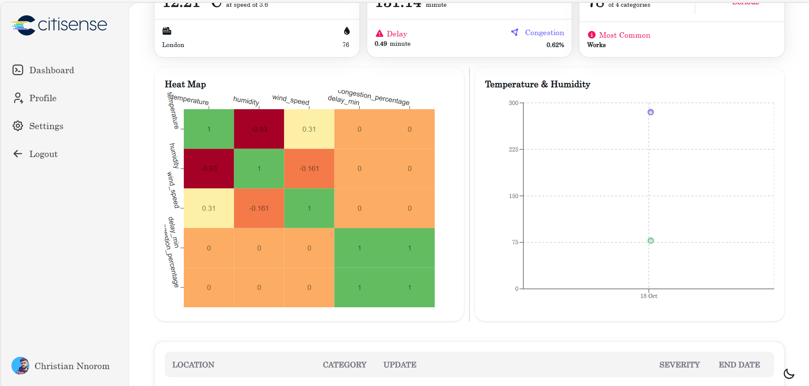
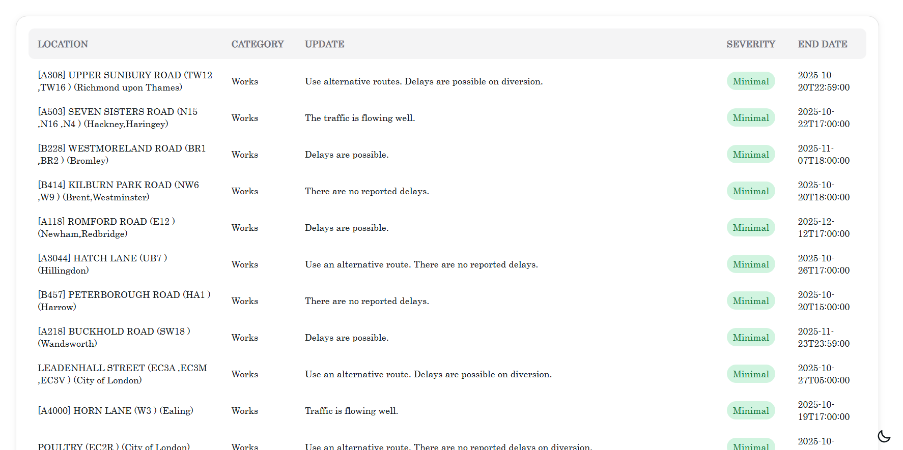

# UTIS: Unified Traffic & Incident System

## Table of Contents

- [UTIS: Unified Traffic \& Incident System](#utis-unified-traffic--incident-system)
  - [Table of Contents](#table-of-contents)
  - [Project Overview](#project-overview)
  - [Setup Instructions](#setup-instructions)
    - [1. Clone the repository](#1-clone-the-repository)
    - [3. Frontend Setup](#3-frontend-setup)
    - [Docker Deployment (Optional)](#docker-deployment-optional)
  - [Architecture Decisions](#architecture-decisions)
  - [Challenges Faced \& Solutions](#challenges-faced--solutions)
  - [Screenshots](#screenshots)
  - [License](#license)

---

## Project Overview

UTIS is a **real-time traffic, weather, and incident monitoring system** for London, implementing a full ETL pipeline, REST API backend, and interactive frontend dashboard.  

**Key Features:**

- Real-time traffic and weather data visualization  
- Interactive Mapbox map with traffic and incidents  
- Dashboard cards with trends, summaries, and correlations  
- Historical data retrieval and JSON exports  
- Full cloud deployment with AWS PostgreSQL and Google Cloud Run  

**Technologies Used:**

- Backend: Python 3.11, FastAPI, SQLAlchemy, Pydantic  
- Database: PostgreSQL (AWS RDS)  
- Frontend: React / Next.js, Redux Toolkit, Recharts, Mapbox GL JS, Tailwind CSS  
- Deployment: Docker, Docker Compose, Google Cloud Run  
- Security: GitHub Actions, npm audit, Snyk  

---

## Setup Instructions

### 1. Clone the repository

```bash
  git clone https://github.com/nnoromiv/utis-frontend.git
```

### 3. Frontend Setup

1 Install dependencies:

```bash
  npm install
```

2 Set environment variables (create a `.env.local` file):

```bash
  NEXT_PUBLIC_API_URL=http://localhost:8000
  NEXT_PUBLIC_MAPBOX_API=<your_mapbox_token>
```

3 Run the development server:

```bash
  npm run dev
```

4 Open the dashboard:

```bash
  http://localhost:3000
```

### Docker Deployment (Optional)

```bash
  docker-compose up --build
```

- Frontend: [http://localhost:3000](http://localhost:3000)
- Backend: [http://localhost:8000](http://localhost:8000)

---

## Architecture Decisions

**React / Next.js frontend:** Provides SSR, component-based architecture, and seamless integration with REST APIs.
**Redux Toolkit + React Query:** Global state management and efficient data fetching with caching.
**Mapbox GL JS:** Interactive geospatial visualization of traffic and incidents.
**Docker & Cloud Run:** Enables reproducible, scalable, and serverless deployment.

---

## Challenges Faced & Solutions

| Challenge                                                | Solution                                                                        |
| -------------------------------------------------------- | ------------------------------------------------------------------------------- |
| Scraping Google Maps blocked by anti-bot protection | Switched to official TfL API for reliable traffic data                          |
| Inconsistent or missing traffic/weather data             | Implemented Pydantic validation and logging                                     |
| Duplicate entries in database                            | Used PostgreSQL `ON CONFLICT` upserts                                           |
| Container startup errors on Cloud Run                    | Configured containers to listen on `$PORT` and removed OS-specific dependencies |
| Ensuring secure environment variables                    | Used GitHub secrets, `.env.local`, and Cloud Run env vars                       |

---

## Screenshots

**Dashboard Overview**


**Traffic Heatmap & Weather Trends**


**Incident Table**


---

## License

MIT License © 2025 Nnorom Christian
